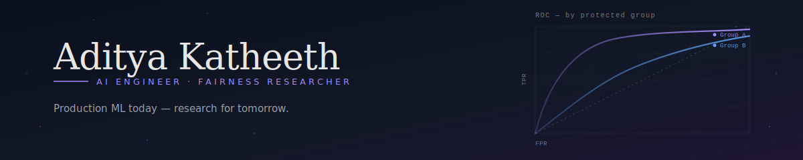
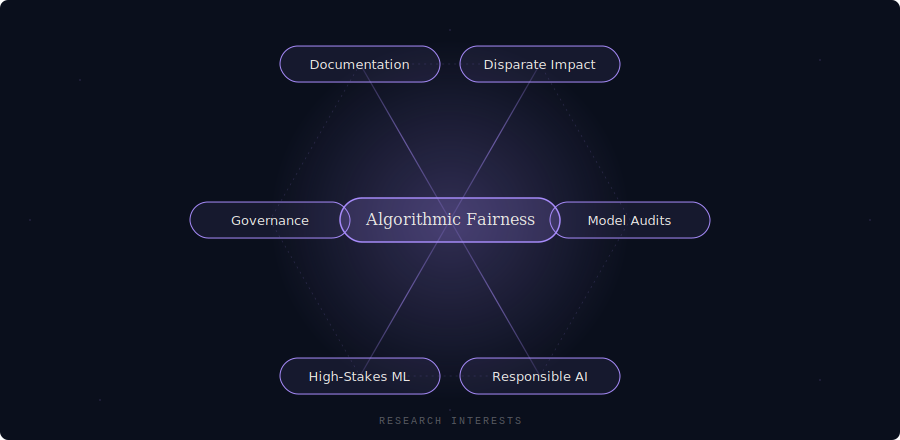
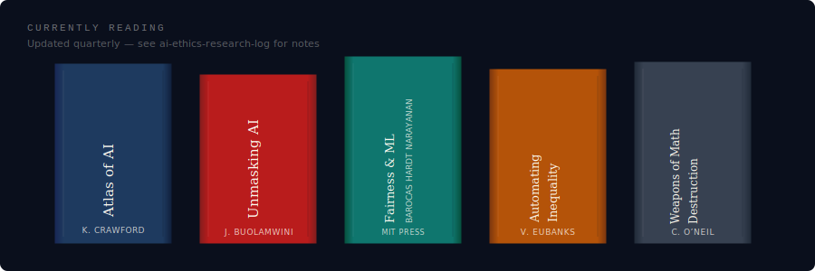

<picture>
  <source media="(prefers-color-scheme: dark)" srcset="assets/banner-dark.svg" />
  <source media="(prefers-color-scheme: light)" srcset="assets/banner-light.svg" />
  
</picture>

 

## Model Card

> An experiment in self-description, borrowing the format from Mitchell et al. (2019).

| | |
|---|---|
| **Intended Use** | Applied ML engineering and algorithmic fairness research. Auditing high-stakes decision systems in credit, hiring, healthcare, and public-sector risk. |
| **Out of Scope** | Formal learning theory. I work on deployed systems and their real-world effects — not on mathematical foundations. |
| **Training Data** | M.S. in Artificial Intelligence. 5+ years in cloud data engineering and production ML. Self-directed study of the fairness and STS literature. |
| **Evaluation Metrics** | Production systems shipped · research notes published · open-source contributions · workshop and conference submissions (FAccT, AIES) |
| **Limitations** | Early in the transition from engineering to academic research. Actively building depth in causal inference, fairness theory, and AI governance. |
| **Ethical Considerations** | Algorithmic audits, disparate-impact measurement, model-card and datasheet documentation, governance frameworks for high-stakes deployments. |

## Current Focus

- **Engineering** — production ML pipelines, feature stores, and model observability on modern cloud data platforms
- **Research** — algorithmic audits, disparate-impact measurement, and documentation standards (model cards, datasheets) for deployed systems
- **Writing** — distilling fairness research for practitioners; submissions targeted at FAccT and AIES

## Tech Stack

  
  
  
  
  

Python · SQL · PyTorch · scikit-learn · Spark · dbt · Terraform

## Research Interests

  

## Currently Reading

  

Notes and excerpts live in <a href="https://github.com/AdityaKatheeth/ai-ethics-research-log"><code>ai-ethics-research-log</code></a>.

## Selected Work

> Placeholders — real repo links land as projects ship.

- **[fairness-audit-toolkit](#)** — reusable harness for running disparate-impact and equal-opportunity audits against tabular classifiers, with model-card generation
- **[ai-ethics-research-log](https://github.com/AdityaKatheeth/ai-ethics-research-log)** — public reading log and working notes for fairness and AI governance research
- **[streaming-ml-platform](#)** — end-to-end Kafka → Spark Structured Streaming → feature store reference implementation

## Activity

  

  

<picture>
  <source media="(prefers-color-scheme: dark)" srcset="https://raw.githubusercontent.com/AdityaKatheeth/AdityaKatheeth/output/snake-dark.svg" />
  <source media="(prefers-color-scheme: light)" srcset="https://raw.githubusercontent.com/AdityaKatheeth/AdityaKatheeth/output/snake.svg" />
  
</picture>

## Contact

Research collaborations, audit work, and fairness consultations welcome.

GitHub · LinkedIn · Email
